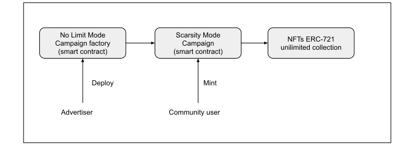
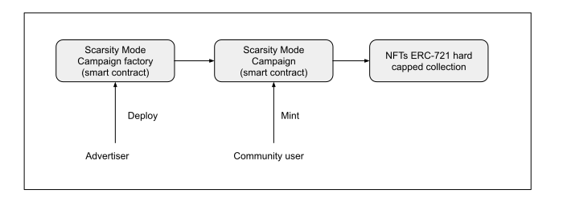
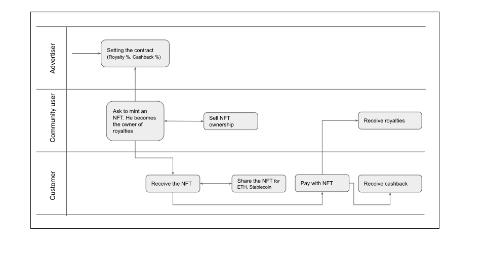

# Introduction

Karma is a decentralized protocol dedicated to product and event marketing. The protocol aims to promote more efficient and economical marketing campaigns by encouraging actors, removing intermediaries, lowering costs, and providing tracking tools. Adopting a blockchain-based solution makes it possible to remove intermediaries and easily complete transactions between insiders. An NFT token with peculiar properties represents a Promotion. The NFT’s properties benefit those who advertise a product and those who buy it.

# Campaigns

The Campaign is the key concept around which all the actors involved in the network revolve. A Campaign is a smart contract that allows the generation of NFTs and the related functionalities they expose, such as crediting Royalties / Cashback and payments.
There are two types of campaigns that the Advertiser can select depending on the use cases.

## No Limit Campaign
minting the NFTs can proceed indefinitely. The Community User doesn't have to anticipate any cost. (ex. The first 500 persons who pay with this campaign can access a special cashback).

## Scarcity Mode Campaign (TBD)
The supply of NFTs availability is fixed. The Community User will have to anticipate the cost of the product price - royalties - cashback to avoid malicious behavior. This mode is preferable when you want to create a limited number of NFTs bound with a scarce product offer (ex., Event seat, cinema seat, limited edition).

# Network overview
The actors involved in the protocol are 5, and each is encouraged to interact with the network through his appropriate incentive.

## Investor 
The investor benefits from the capital gain on the token and the dividends from the protocol's success. The role of the investor is essential to the bootstrap of the project and to increase the value of the KRM token. 

## Advertiser
The Advertiser forms part of the heart of the network. Its task is to publish marketing Campaigns. The main interest of the Advertiser is to maximize the effectiveness of its campaigns by cooperating in synergy with the Community User. The Advertiser’s interests will therefore be to spend as little as possible for the generation of the Campaign and to have tools available to track its success.

## Community user
The Community user interacts with the tools exposed by the campaign to generate NFTs. After you have minted your NFT, you will aim to spread it. A customer who purchases a product through an NFT will receive royalties.

## Content Creator
The content creator can generate useful advertising material for the advertiser, images, videos, etc. When a campaign is deployed, The advertiser can decide whether to pay the content creator a fixed amount or a percentage of sales.

## Customer
The Customer is the final user of the NTFs produced by the Campaigns. Each time the user purchases a product through an NFT, he receives the cashback and the Community User the royalties.

# Tokenomics

The network transactions are executed with ERC-20 tokens. They can be a custom advertiser token or a stable coin (USDC, USDT, etc..). Transaction fees are paid with KRM tokens.

Fees payments are payed when an Advertiser wants to launch a new campaign. In this case, the Advertiser will pay an Ethereum transaction fee plus another constant KRM fee for the Campaign deployment. When the Advertiser pays the Campaign deployment fee, KRM will be locked by the smart contract, to be distributed to the network adopters. (TBD)

